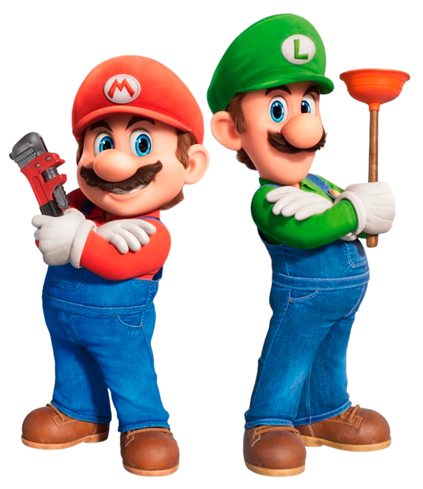

# Projeto Mario 🚀

Este é um site simples onde usei pela primeira vez **JavaScript** para adicionar interatividade, além de aplicar todo o poder do **HTML** e **CSS** para criar uma interface bonita e funcional.

Foi uma experiência incrível para entender como essas tecnologias trabalham juntas para construir páginas web dinâmicas.

---

## 🛠️ Tecnologias usadas

- 🌐 HTML5  

- 🎨 CSS3  

- ⚙️ JavaScript

---

